# BoredApp

An android application that allows you to dowlnoad random or customized ideas from Bored API. Written in MVP architecture, using Dagger 2 as Dependency Injection in Java. Other technologies used are: RxJava 3, Butterknife, Room and Material Design.
To delete an idea, wipe it to left or right. Additionally, it is possible to reverse this event via "undo" button in snackbar.    

The application also includes two widgets. The first, small button that allows you to start a service that gets the idea from the api and send idea as notification. The notification allows you to save the idea to the database.   

The second widget is a list of ideas that you can pin to your screen. Refreshing this widget is automatic after 30 minutes, or after clicking the refresh button. Additionally, the light bulb button allows you to receive the idea as a notification like the first widget. The list widget has an application title, that allows you to open it. Additionally, when you click on an idea containing a link, a reference to the website, it will be opened in the browser.   

Link to Bored API website: [Bored Api](https://www.boredapi.com/)

## Table of contents:
* [Technologies](#technologies)
* [Illustrations](#illustrations)

## Technologies
Project is created with:
* Java
* RxJava 3
* Dagger 2
* Butterknife
* Material Design
* Room
* Android Studio
* Gradle

## Illustrations

 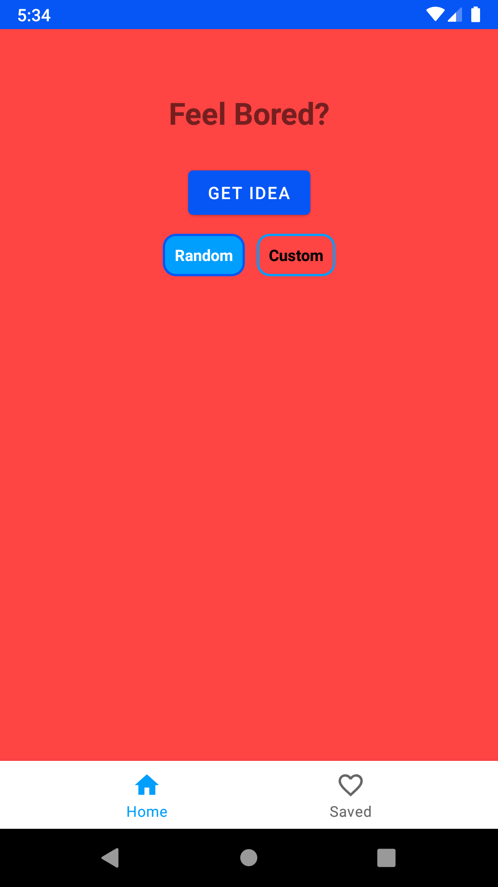
 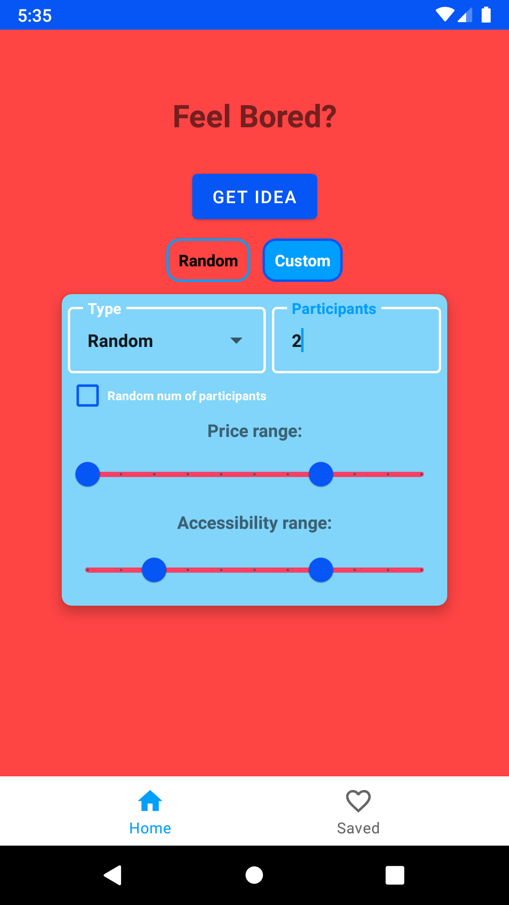
 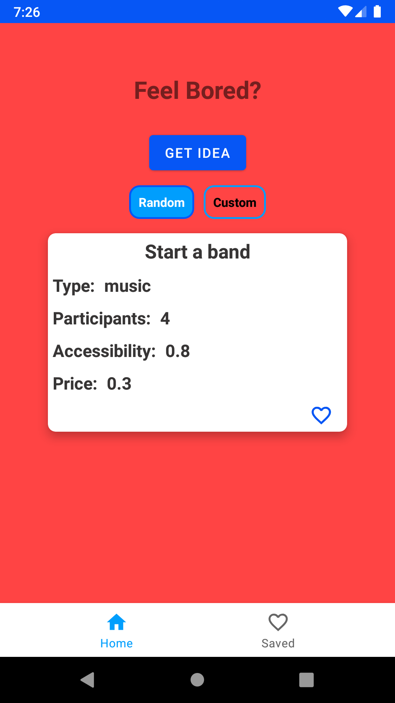
 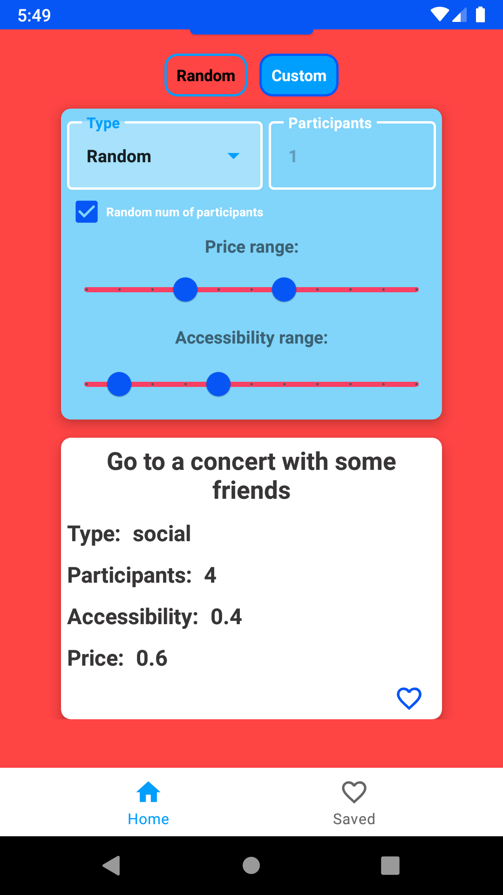
 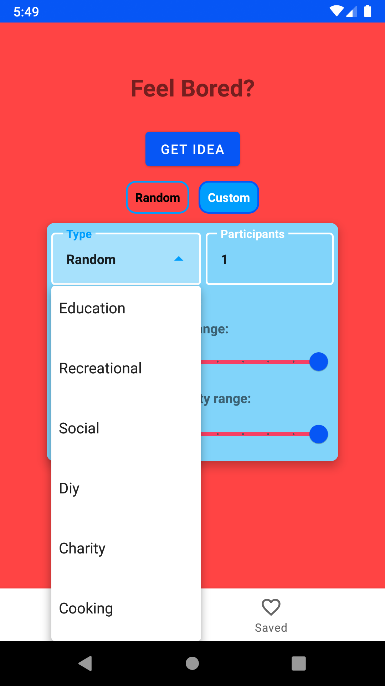
 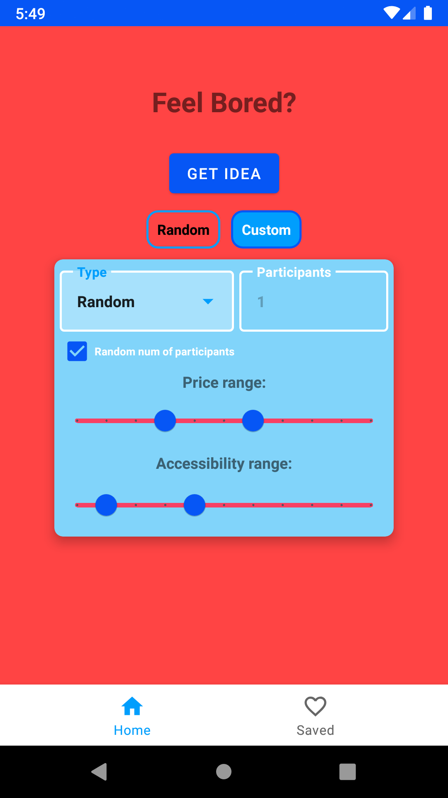
 
 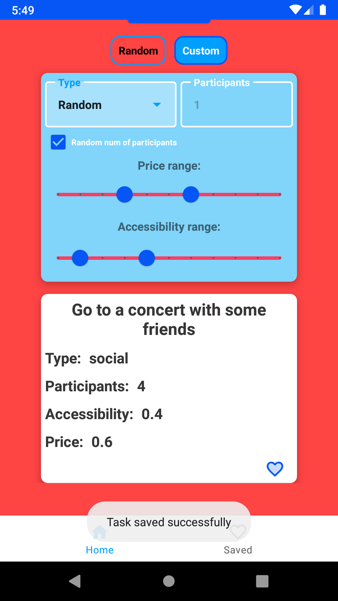
 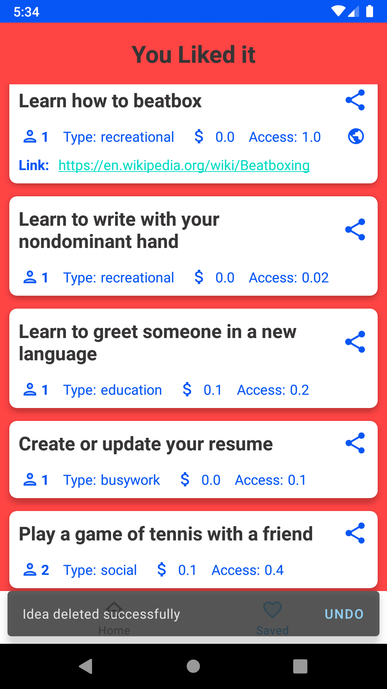
 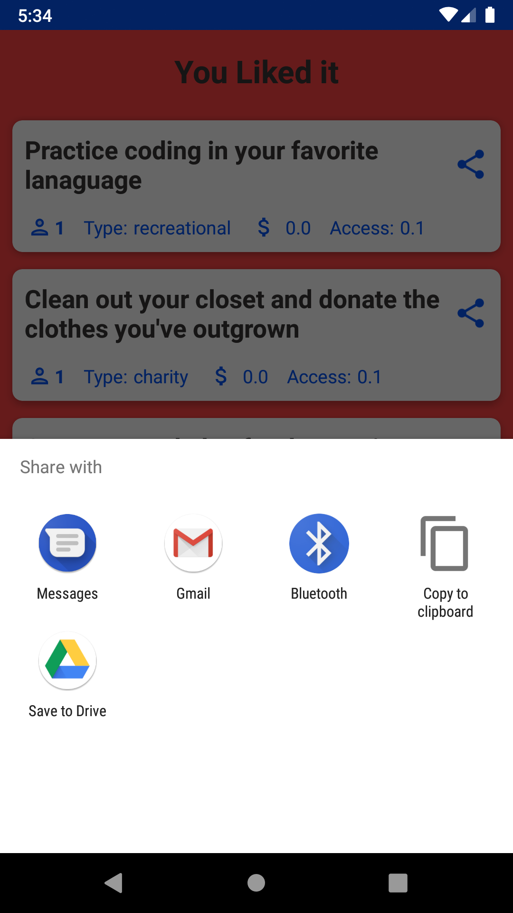
 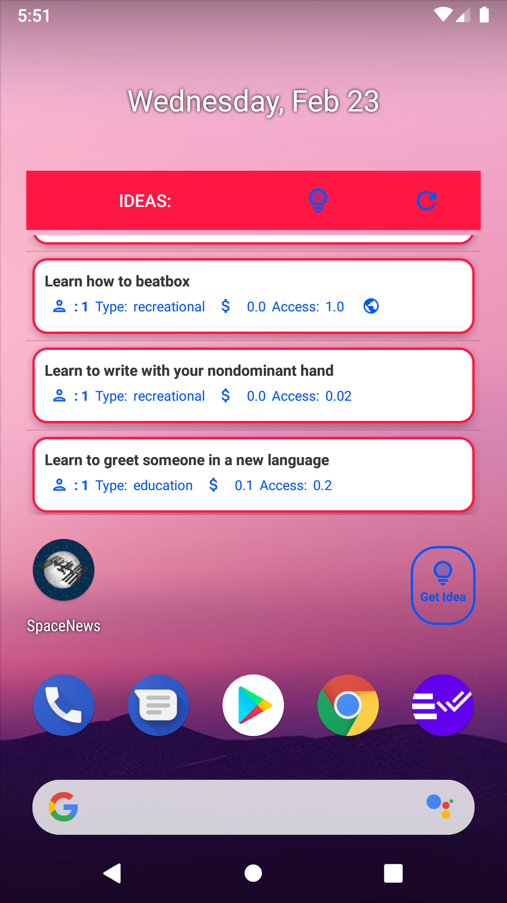
 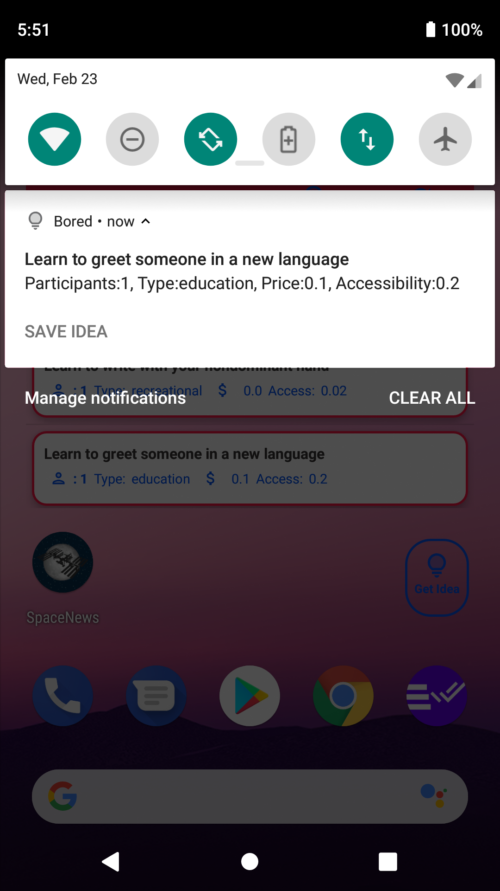
 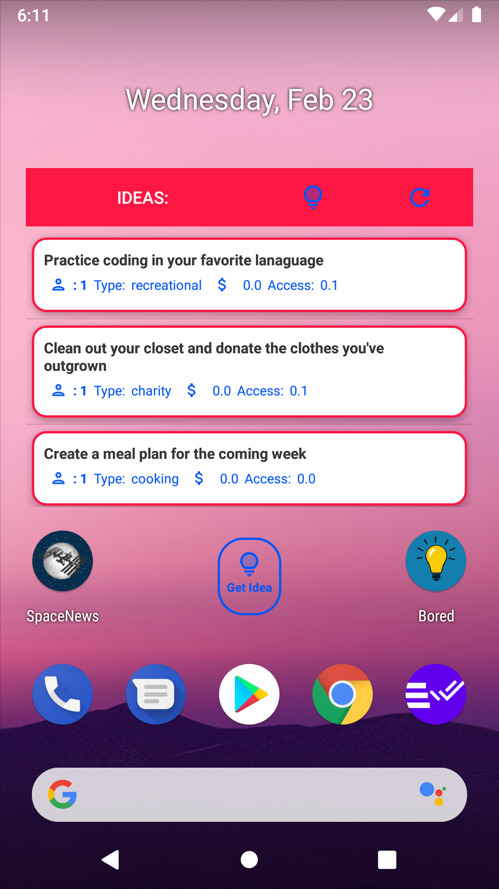
 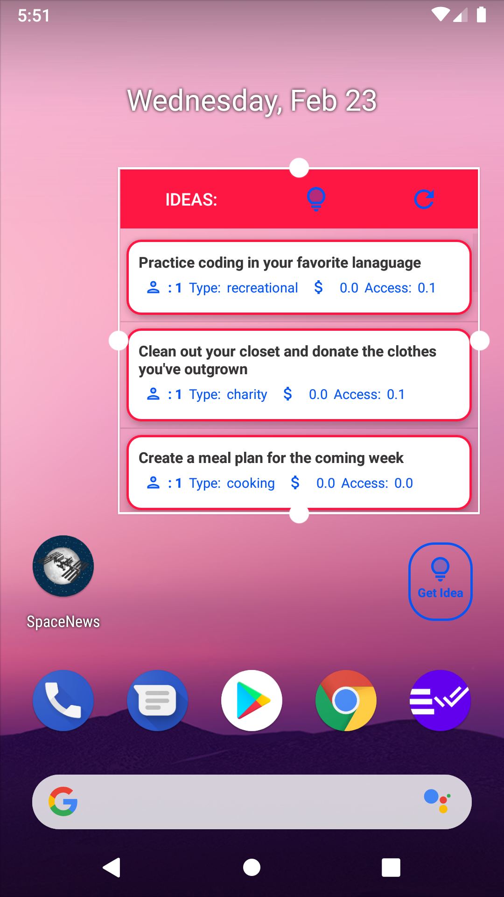
 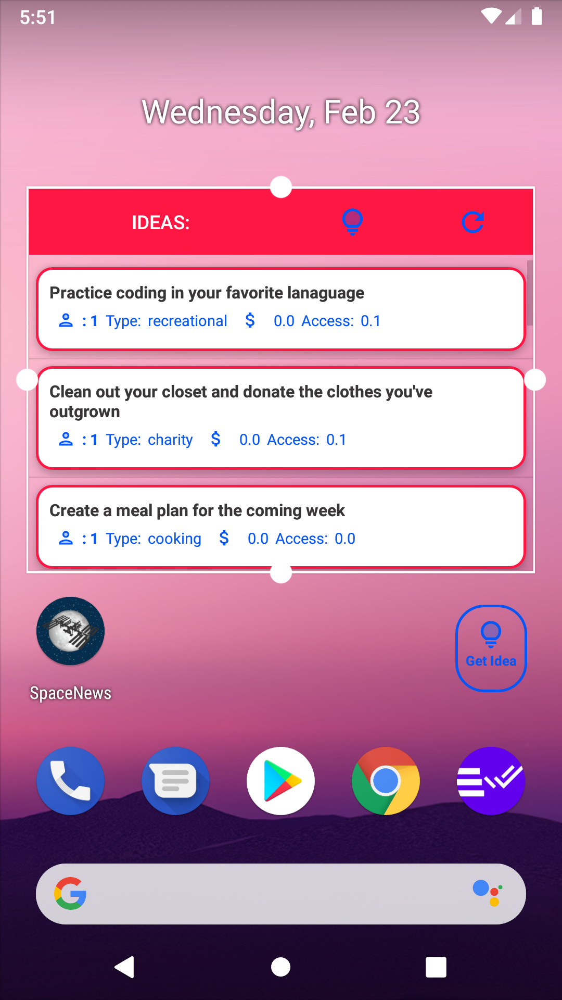
 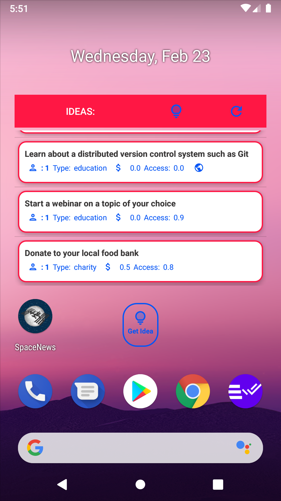

